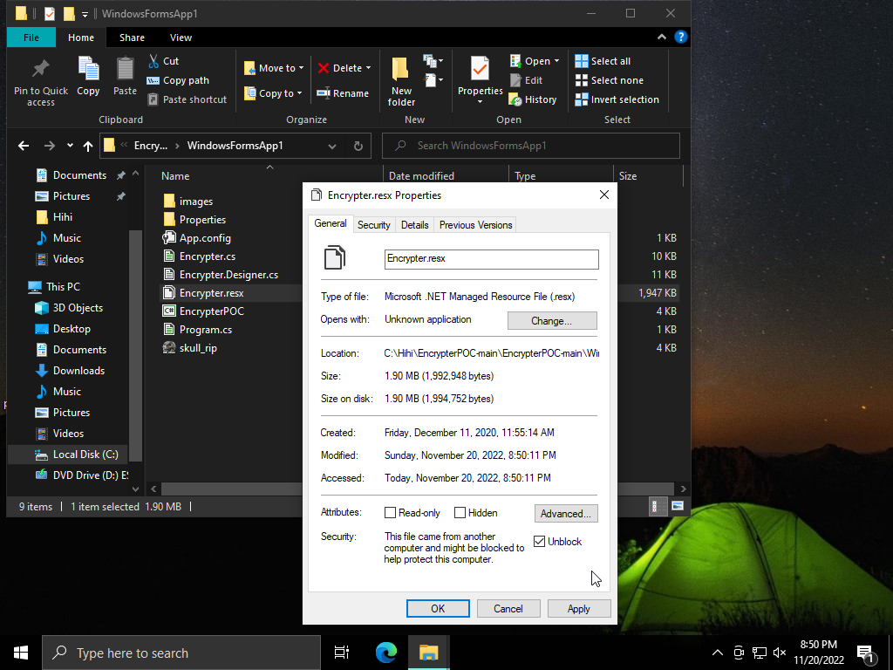
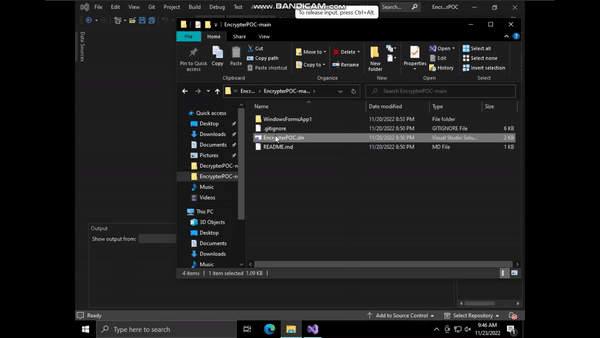
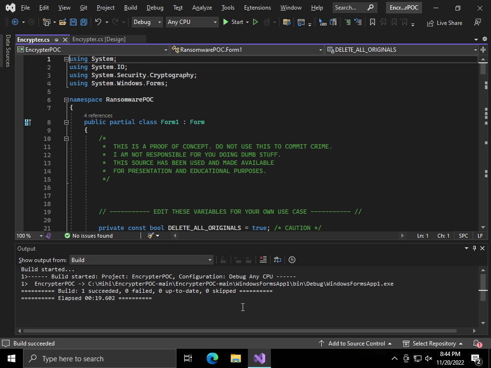
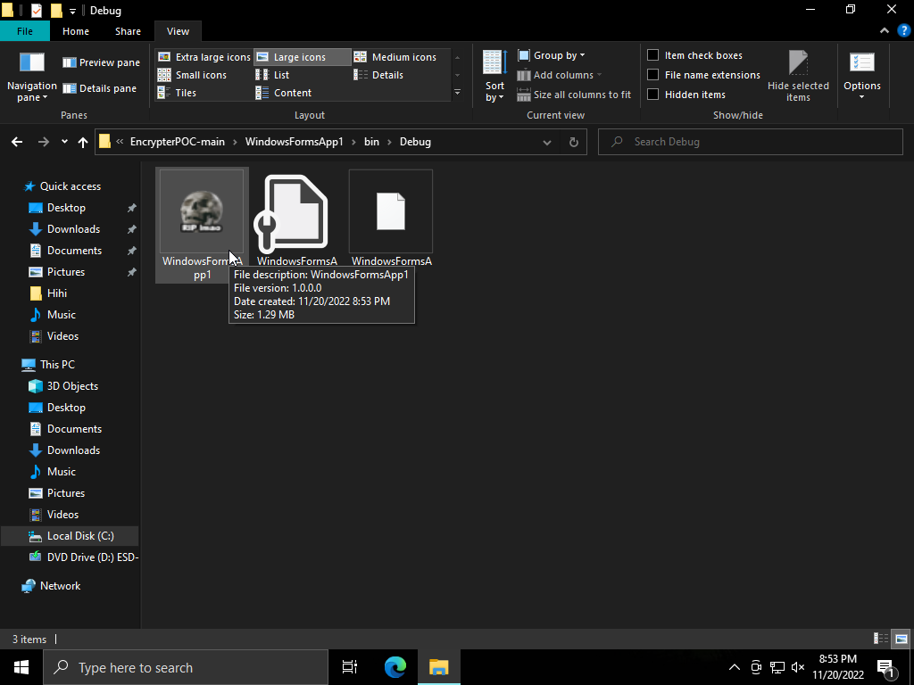
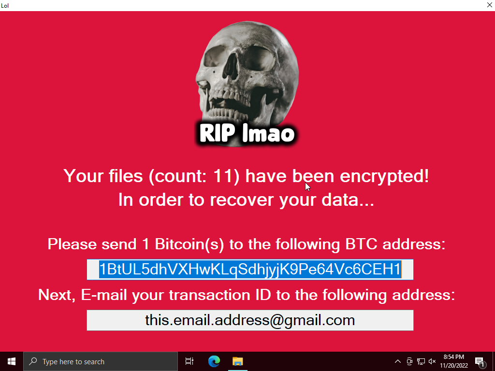
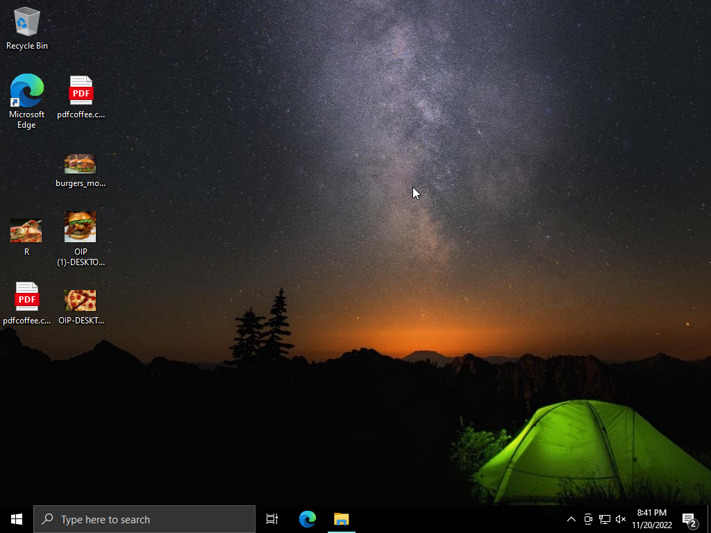
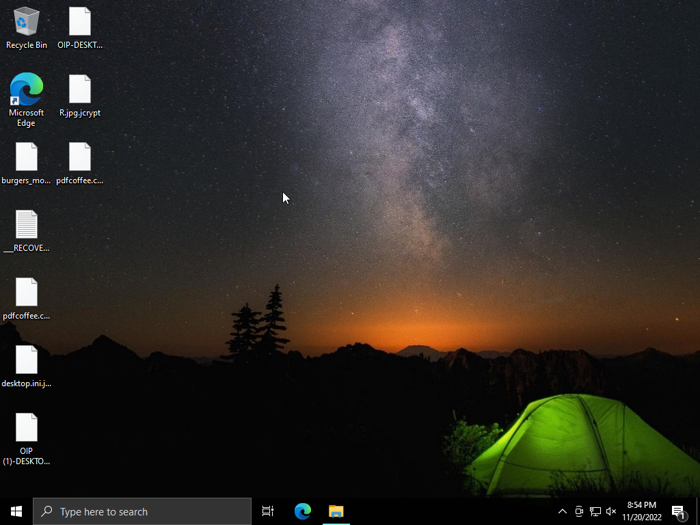
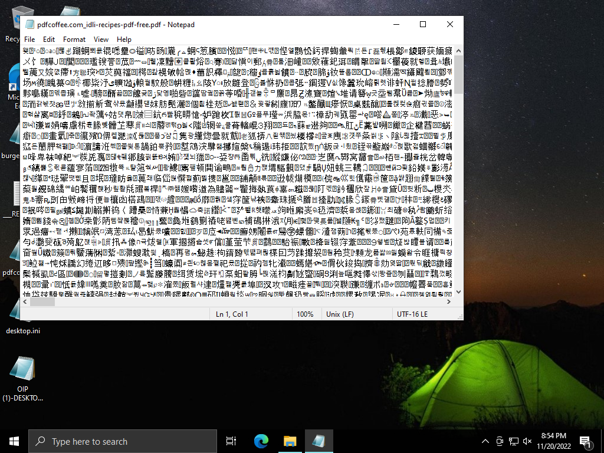
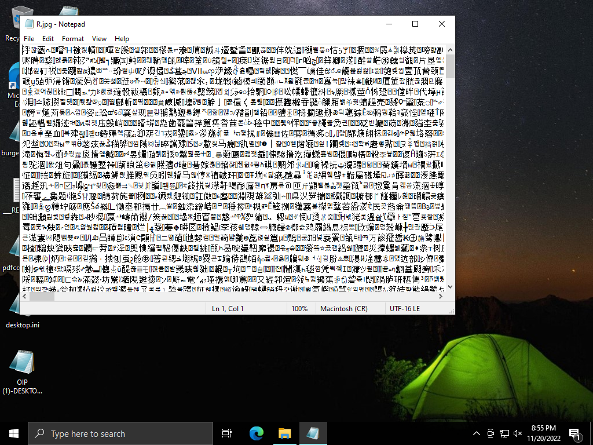

# Ransomware-Test-Run
<ins>**Foreword**<ins>

Its an age old fact that ransomware is massive issue in the cybersecurity community. There was, are and will be ransomware forever. From small organizations to Multi National Companies, ransomware is a major threat which isnt likely to go away anytime soon. So yeah the best we can do is be updated with the latest threat and pray our defences cant be penetrated. Next on I will be demonstrating how a ransomware works. 

<ins>***DISCLAIMER***<ins>

<ins>**This is meant to be used as knowledge purposes only. The demo given is totally harmless given followed the given instructions. Any extensions or modifications from the demonstration is solely the individuals responsilibilty. Im not responsible for any of your actions.**<ins>

<ins>**Introduction**<ins>

This ransomware is meant to encrypt all the files you have in your desktop (can be modified to according to preference) and demand a ransom in Bitcion(BTC) Cryptocurrency for the retrieval of the files. Upon transferring the needed amount to the hackers crypto wallet, the victim will have to send an email showing the proof of payment, the hacker will decrypt (LOL, if only .-.) the files. 

<ins>**Walkthrough**<ins>

Okay so for those whom plan to follow along, just <ins>***MAKE SURE YOU DO IT IN A VIRTUAL MACHINE OR SANDBOXED ENVIRONMENT. DO NOT ATTEMPT OR DOWNLOAD THIS INTO YOUR PERSONAL SYSTEM. IF YOU DO SO, THERE ARE HIGH CHANCES YOU AINT GONNA GET BACK YOUR BELOVED FILES //:***<ins>

  1) Download [Visual Studio Code Community Edition](https://visualstudio.microsoft.com/vs/community/), [Encrypter Code](https://github.com/joshmadakor1/EncrypterPOC) and [Decrypter Code](https://github.com/joshmadakor1/DecrypterPOC). Make sure to          save it in a designated file on your primary hard drive (C:). Unzip the folders. 
  2) In the EcryptPOC folder, select WindowsFormsApp1 and right click on the file "Encrypter.resx". Choose properties and at the bottom right tick the "unblock" option for security. This has to be done to mitigate the security measures taken by Windows and Visual Code. 
  
  
  
  3) Head back to the EncrypterPOC folder and open the file "EncrypterPOC.sln" in Visual Studio. Upon opening the file, at the right corner under "Solution Explorer" expand the "EncrypterPOC" file and click on "Encrypter.cs". Then an Graphical User Interface(GUI) will come. It will be named as "Encrypter.cs[Design]". Click on view at the top left corner and select "Code" or press "F7" key. We will have the needed code there and a section which we can change according to our preference will be there. Again,  <ins>***DONT USE THIS TO DO ILLEGAL STUFF***</ins>. If the instructions are unclear, just follow the guide provided below : 
  
  
  
4) Upon changing the details according to your preference, navigate to the "Build" option and choose "Build Solution". The "Output" section should show this upon building : 

5) Head to the "EncrypterPOC" folder and navigate from WindowsFormsApp1 > bin > Debug and run the "WindowsFormApp1.exe" file. (Given you cant find the folder, chances are you probably missed a step or two :P)

6) Now the malware has officially been launched. You will get this "Message" given you have properly executed the malware :

You will be able to see live of how the malware interacts with the files in your desktop.

This is how the files were before the malware : 

 

This is how it is after the files are encypted : 

The files will have a weird wordings in Chinese/Japanese, sometimes even in unknown characters. In short the file is not rendered unusable, but it is just encrypted in .jcrypt format. Opening an encypted file in "Notepad"(most logical format to be opened in) will have these contents :

 

<ins>A PDF Document File</ins>

<ins>A JPG Image File</ins>
7) So at this stage, there no real turning back and the files cant ever be retrieved without running the decrypter. If you arent confident with executing the prior steps, dont worry, just delete the VM and just retry. Again, <ins>***MAKE SURE TO RUN THIS USING A VIRTUAL MACHINE***</ins>, cuz if you dont, maybe god be with you :p

